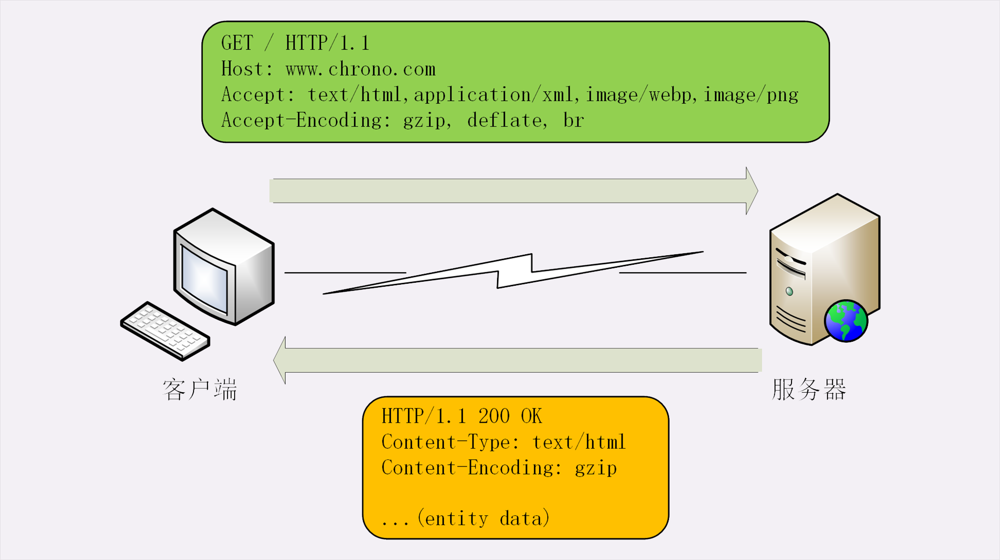
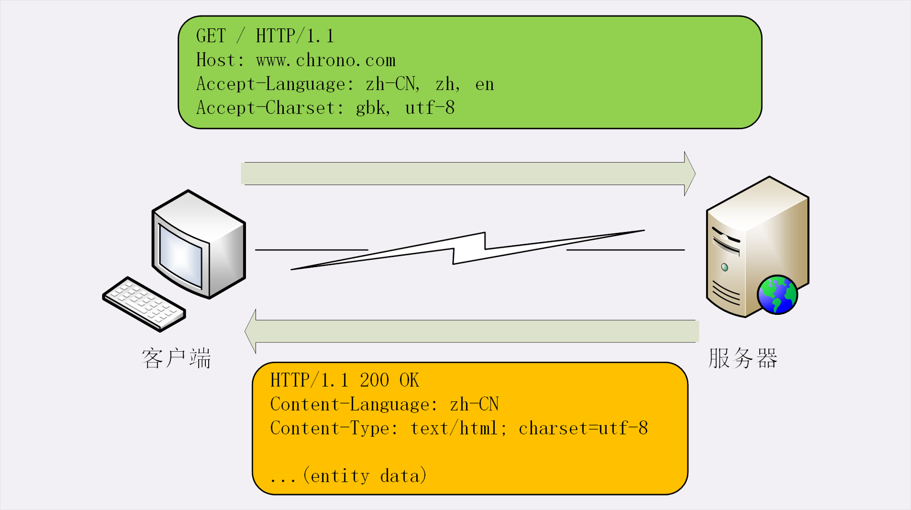
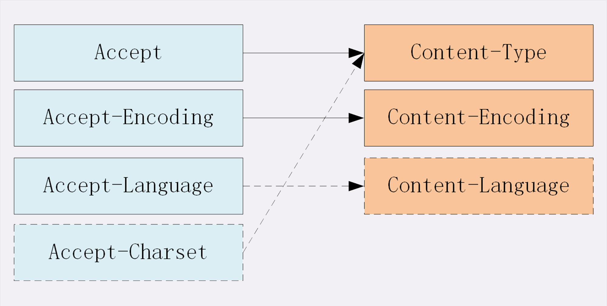

## 数据类型与编码

HTTP 协议是应用层的协议，数据到达之后工作只能说是完成了一半，还必须要告诉上层应用这是什么数据才行，否则上层应用就会“不知所措”。

### MIME

幸运的是，早在 HTTP 协议诞生之前就已经有了针对这种问题的解决方案，不过它是用在电子邮件系统里的，让电子邮件可以发送 ASCII 码以外的任意数据，方案的名字叫做“**多用途互联网邮件扩展**”（Multipurpose Internet Mail Extensions），简称为 MIME。

MIME 是一个很大的标准规范，但 HTTP 只“顺手牵羊”取了其中的一部分，用来标记 body 的数据类型，这就是我们平常总能听到的“**MIME type**”。

MIME 把数据分成了八大类，每个大类下再细分出多个子类，形式是“**type/subtype**”的字符串，巧得很，刚好也符合了 HTTP 明文的特点，所以能够很容易地纳入 HTTP 头字段里。


这里简单列举一下在 HTTP 里经常遇到的几个类别：

1. text：即文本格式的可读数据，我们最熟悉的应该就是 text/html 了，表示超文本文档，此外还有纯文本 text/plain、样式表 text/css 等。

2. image：即图像文件，有 image/gif、image/jpeg、image/png 等。

3. audio/video：音频和视频数据，例如 audio/mpeg、video/mp4 等。

4. application：数据格式不固定，可能是文本也可能是二进制，必须由上层应用程序来解释。常见的有 application/json，application/javascript、application/pdf 等，另外，如果实在是不知道数据是什么类型，像刚才说的“黑盒”，就会是 application/octet-stream，即不透明的二进制数据。

   **application/x-www-form-urlencoded**

   它是post的默认格式，使用js中URLencode转码方法。包括将name、value中的空格替换为加号；将非ascii字符做百分号编码；将input的name、value用‘=’连接，不同的input之间用‘&’连接。

   同样使用URLencode转码，这种post格式跟get的区别在于，get把转换、拼接完的字符串用‘?’直接与表单的action连接作为URL使用，所以请求体里没有数据；而post把转换、拼接后的字符串放在了请求体里，不会在浏览器的地址栏显示，因而更安全一些。

   **multipart/form-data**

   为什么要新增一个类型，而不使用旧有的`application/x-www-form-urlencoded`：因为此类型不适合用于传输大型二进制数据或者包含非ASCII字符的数据。平常我们使用这个类型都是把表单数据使用url编码后传送给后端，二进制文件当然没办法一起编码进去了。所以`multipart/form-data`就诞生了，专门用于有效的传输文件。

   


### 编码

但仅有 MIME type 还不够，因为 HTTP 在传输时为了节约带宽，有时候还会压缩数据，为了不要让浏览器继续“猜”，还需要有一个“Encoding type”，告诉数据是用的什么编码格式，这样对方才能正确解压缩，还原出原始的数据。

比起 MIME type 来说，Encoding type 就少了很多，常用的只有下面三种：

1. gzip：GNU zip 压缩格式，也是互联网上最流行的压缩格式；
2. deflate：zlib（deflate）压缩格式，流行程度仅次于 gzip；
3. br：一种专门为 HTTP 优化的新压缩算法（Brotli）。


## 语言类型与字符集

MIME type 和 Encoding type 解决了计算机理解 body 数据的问题，但互联网遍布全球，不同国家不同地区的人使用了很多不同的语言，虽然都是 text/html，但如何让浏览器显示出每个人都可理解可阅读的语言文字呢？

这实际上就是“国际化”的问题。HTTP 采用了与数据类型相似的解决方案，又引入了两个概念：语言类型与字符集。

“**语言类型**”就是人类使用的自然语言。使用“type-subtype”的形式。

“**字符集**”，处理文字的字符编码方式。


## 内容协商



如果请求报文里没有 Accept-Encoding 字段，就表示客户端不支持压缩数据；如果响应报文里没有 Content-Encoding 字段，就表示响应数据没有被压缩。





### 内容协商的质量值

权重的最大值是 1，最小值是 0.01，默认值是 1，如果值是 0 就表示拒绝。

```
Accept: text/html,application/xml;q=0.9,*/*;q=0.8
```


### 内容协商的结果

内容协商的过程是不透明的，每个 Web 服务器使用的算法都不一样。但有的时候，服务器会在响应头里多加一个**Vary**字段，记录服务器在内容协商时参考的请求头字段，给出一点信息，例如：

```
Vary: Accept-Encoding,User-Agent,Accept
```

也就是说，同一个 URI 可能会有多个不同的“版本”，主要用在传输链路中间的代理服务器实现缓存服务。


## 小结

