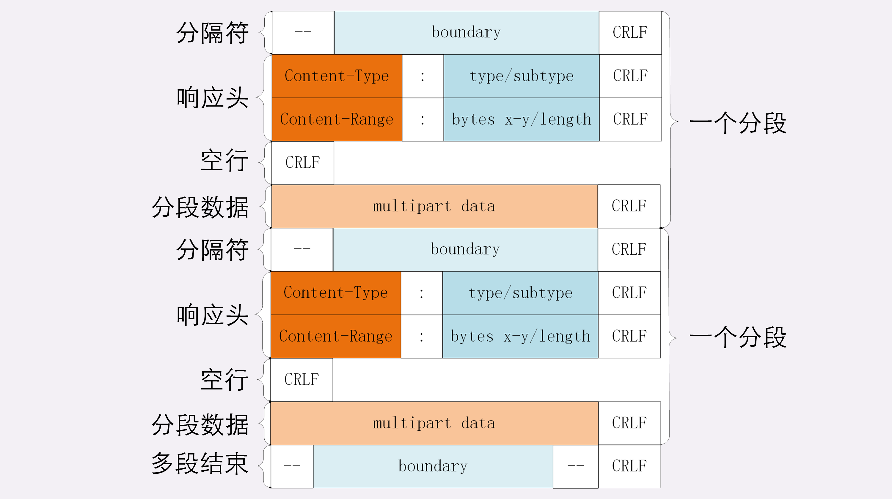

## HTTP传输大文件的方法


### 数据压缩

通常浏览器在发送请求时都会带着“**Accept-Encoding**”头字段，里面是浏览器支持的压缩格式列表，例如 gzip、deflate、br 等，这样服务器就可以从中选择一种压缩算法，放进“**Content-Encoding**”响应头里，再把原数据压缩后发给浏览器。


### 分块传输

“拆开”，分解成多个小块，把这些小块分批发给浏览器，浏览器收到后再组装复原。

这样浏览器和服务器都不用在内存里保存文件的全部，每次只收发一小部分，网络也不会被大文件长时间占用，内存、带宽等资源也就节省下来了。

这种“**化整为零**”的思路在 HTTP 协议里就是“**chunked**”分块传输编码，在响应报文里用头字段“**Transfer-Encoding: chunked**”来表示，意思是报文里的 body 部分不是一次性发过来的，而是分成了许多的块（chunk）逐个发送。

“Transfer-Encoding: chunked”和“Content-Length”这两个字段是**互斥的**，也就是说响应报文里这两个字段不能同时出现，一个响应报文的传输要么是长度已知，要么是长度未知（chunked），这一点你一定要记住。


### 范围请求

范围请求不是 Web 服务器必备的功能，可以实现也可以不实现，所以服务器必须在响应头里使用字段“**Accept-Ranges: bytes**”明确告知客户端：“我是支持范围请求的”。

如果不支持的话该怎么办呢？服务器可以发送“Accept-Ranges: none”，或者干脆不发送“Accept-Ranges”字段，这样客户端就认为服务器没有实现范围请求功能，只能老老实实地收发整块文件了。

请求头**Range**是 HTTP 范围请求的专用字段，格式是“**bytes=x-y**”，其中的 x 和 y 是以字节为单位的数据范围。

服务器要添加一个响应头字段**Content-Range**，告诉片段的实际偏移量和资源的总大小，格式是“**bytes x-y/length**”，与 Range 头区别在没有“=”，范围后多了总长度。例如，对于“0-10”的范围请求，值就是“bytes 0-10/100”。

```
GET /16-2 HTTP/1.1
Host: www.chrono.com
Range: bytes=0-31
```

```
HTTP/1.1 206 Partial Content
Content-Length: 32
Accept-Ranges: bytes
Content-Range: bytes 0-31/96
```


### 多段数据

刚才说的范围请求一次只获取一个片段，其实它还支持在 Range 头里使用多个“x-y”，一次性获取多个片段数据。

这种情况需要使用一种特殊的 MIME 类型：“**multipart/byteranges**”，表示报文的 body 是由多段字节序列组成的，并且还要用一个参数“**boundary=xxx**”给出段之间的分隔标记。最后用一个“- -boundary- -”（前后各有两个“-”）表示所有的分段结束。




```
GET /16-2 HTTP/1.1
Host: www.chrono.com
Range: bytes=0-9, 20-29
```

```
HTTP/1.1 206 Partial Content
Content-Type: multipart/byteranges; boundary=00000000001
Content-Length: 189
Connection: keep-alive
Accept-Ranges: bytes
 
 
--00000000001
Content-Type: text/plain
Content-Range: bytes 0-9/96
 
// this is
--00000000001
Content-Type: text/plain
Content-Range: bytes 20-29/96
 
ext json d
--00000000001--
```


