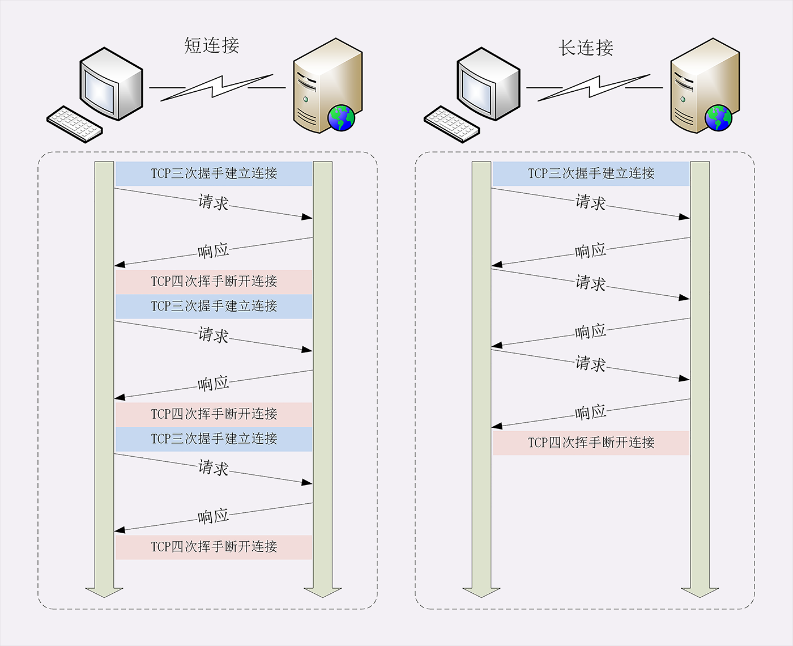
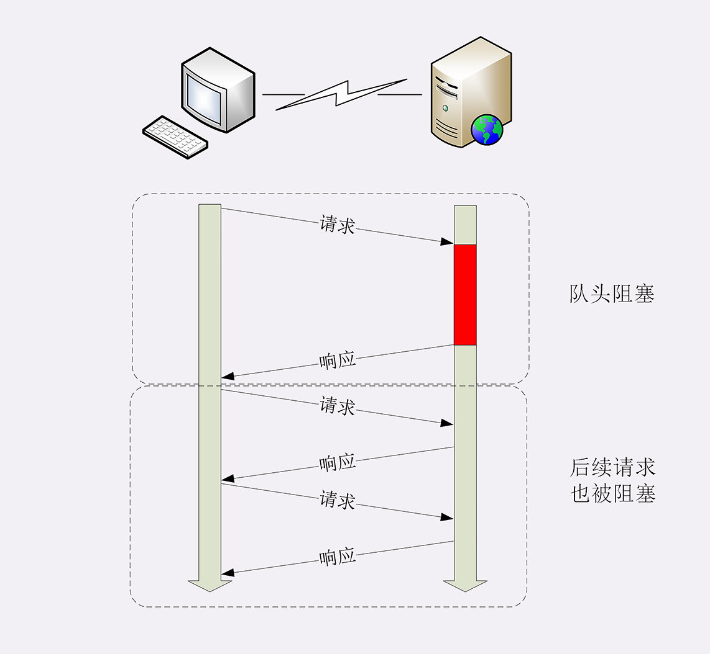

# HTTP的连接管理

## 长短连接

### 连接相关的头字段

由于长连接对性能的改善效果非常显著，所以在 HTTP/1.1 中的连接都会默认启用长连接。不需要用什么特殊的头字段指定，只要向服务器发送了第一次请求，后续的请求都会重复利用第一次打开的 TCP 连接，也就是长连接，在这个连接上收发数据。

当然，我们也可以在请求头里明确地要求使用长连接机制，使用的字段是**Connection**，值是“**keep-alive**”。

不过不管客户端是否显式要求长连接，如果服务器支持长连接，它总会在响应报文里放一个“**Connection: keep-alive**”字段，告诉客户端：“我是支持长连接的，接下来就用这个 TCP 一直收发数据吧”。

### TIME_WAIT

数据包在网络中是有生存时间的，超过这个时间还未到达目标主机就会被丢弃，并通知源主机。这称为**报文最大生存时间（MSL，Maximum Segment Lifetime）**。TIME_WAIT 要等待 2MSL 才会进入 **CLOSED** 状态。ACK 包到达服务器需要 MSL 时间，服务器重传 FIN 包也需要 MSL 时间，2MSL 是数据包往返的最大时间，如果 2MSL 后还未收到服务器重传的 FIN 包，就说明服务器已经收到了 ACK 包。

### TCP 连接长时间不关闭占用资源

服务器端通常不会主动关闭连接，但也可以使用一些策略。拿 Nginx 来举例，它有两种方式：

1. 使用“keepalive_timeout”指令，设置长连接的超时时间，如果在一段时间内连接上没有任何数据收发就主动断开连接，避免空闲连接占用系统资源。
2. 使用“keepalive_requests”指令，设置长连接上可发送的最大请求次数。比如设置成 1000，那么当 Nginx 在这个连接上处理了 1000 个请求后，也会主动断开连接。

## 队头阻塞

### 并发连接

因为“请求 - 应答”模型不能变，所以“队头阻塞”问题在 HTTP/1.1 里无法解决，只能缓解，有什么办法呢？

公司里可以再多买几台打卡机放在前台，这样大家可以不用挤在一个队伍里，分散打卡，一个队伍偶尔阻塞也不要紧，可以改换到其他不阻塞的队伍。

这在 HTTP 里就是“**并发连接**”（concurrent connections），也就是同时对一个域名发起多个长连接，用数量来解决质量的问题。

### 域名分片

单个域名只能连接一定数量的TCP，那就多用几个域名。