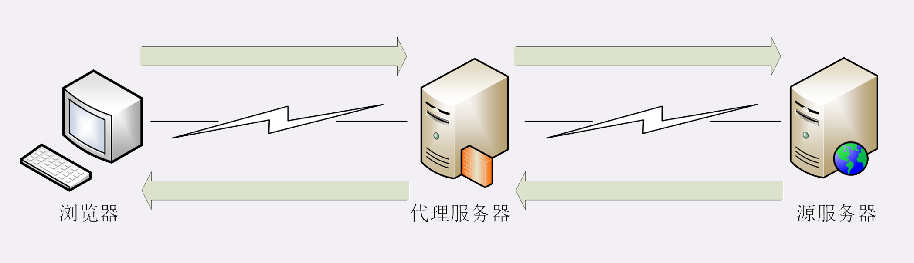
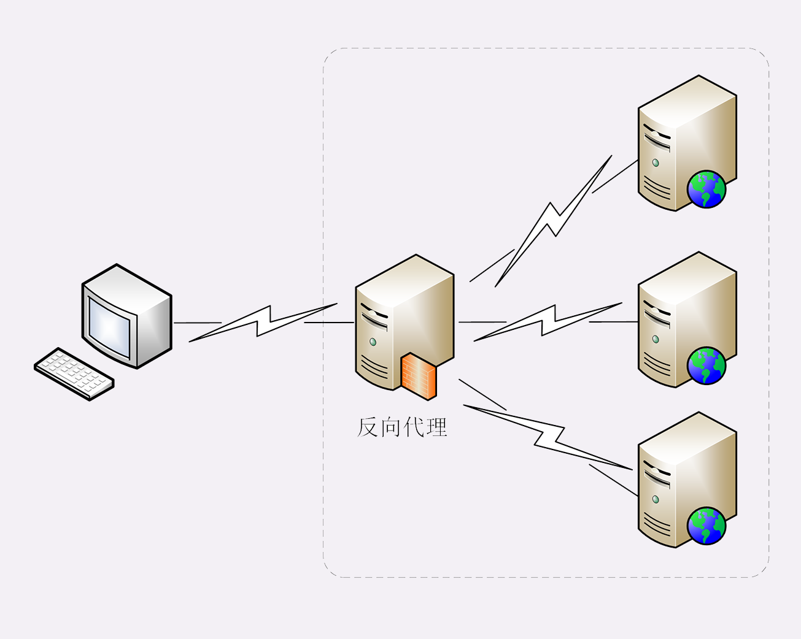
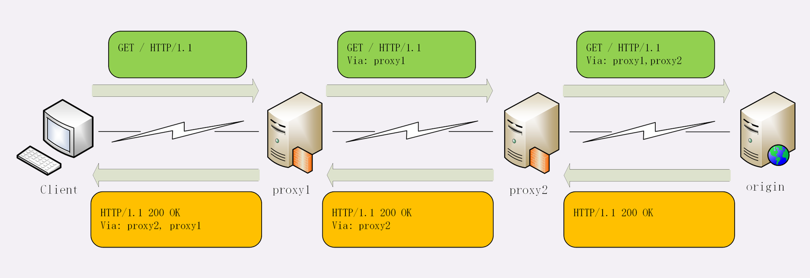

# HTTP的代理服务

所谓的“代理服务”就是指服务本身不生产内容，而是处于中间位置转发上下游的请求和响应，具有双重身份：面向下游的用户时，表现为服务器，代表源服务器响应客户端的请求；而面向上游的源服务器时，又表现为客户端，代表客户端发送请求。

## 代理的作用

代理最基本的一个功能是**负载均衡**。因为在面向客户端时屏蔽了源服务器，客户端看到的只是代理服务器，源服务器究竟有多少台、是哪些 IP 地址都不知道。于是代理服务器就可以掌握请求分发的“大权”，决定由后面的哪台服务器来响应请求。

在负载均衡的同时，代理服务还可以执行更多的功能，比如：

- **健康检查**：使用“心跳”等机制监控后端服务器，发现有故障就及时“踢出”集群，保证服务高可用；
- **安全防护**：保护被代理的后端服务器，限制 IP 地址或流量，抵御网络攻击和过载；
- **加密卸载**：对外网使用 SSL/TLS 加密通信认证，而在安全的内网不加密，消除加解密成本；
- **数据过滤**：拦截上下行的数据，任意指定策略修改请求或者响应；
- **内容缓存**：暂存、复用服务器响应，这个我们稍后再说。

## 代理相关头字段

### via

### Forwarded-For 和 X-Real-IP

Via 字段只解决了客户端和源服务器判断是否存在代理的问题，还不能知道对方的真实信息。

但服务器的 IP 地址应该是保密的，关系到企业的内网安全，所以一般不会让客户端知道。不过反过来，通常服务器需要知道客户端的真实 IP 地址，方便做访问控制、用户画像、统计分析。

可惜的是 HTTP 标准里并没有为此定义头字段，但已经出现了很多“事实上的标准”，最常用的两个头字段是“**X-Forwarded-For**”和“**X-Real-IP**”。

X-Forwarded-For”的字面意思是“为谁而转发”，形式上和“Via”差不多，也是每经过一个代理节点就会在字段里追加一个信息。但“Via”追加的是代理主机名（或者域名），而“X-Forwarded-For”追加的是请求方的 IP 地址。所以，在字段里最左边的 IP 地址就客户端的地址。

“X-Real-IP”是另一种获取客户端真实 IP 的手段，它的作用很简单，就是记录客户端 IP 地址，没有中间的代理信息，相当于是“X-Forwarded-For”的简化版。如果客户端和源服务器之间只有一个代理，那么这两个字段的值就是相同的。

## 代理协议

有了“X-Forwarded-For”等头字段，源服务器就可以拿到准确的客户端信息了。但对于代理服务器来说它并不是一个最佳的解决方案。

因为通过“X-Forwarded-For”操作代理信息必须要解析 HTTP 报文头，这对于代理来说成本比较高，原本只需要简单地转发消息就好，而现在却必须要费力解析数据再修改数据，会降低代理的转发性能。

另一个问题是“X-Forwarded-For”等头必须要修改原始报文，而有些情况下是不允许甚至不可能的（比如使用 HTTPS 通信被加密）。

所以就出现了一个专门的“代理协议”（The PROXY protocol），它由知名的代理软件 HAProxy 所定义，也是一个“事实标准”，被广泛采用（注意并不是 RFC）。

“代理协议”有 v1 和 v2 两个版本，v1 和 HTTP 差不多，也是明文，而 v2 是二进制格式。今天只介绍比较好理解的 v1，它在 HTTP 报文前增加了一行 ASCII 码文本，相当于又多了一个头。

这一行文本其实非常简单，开头必须是“PROXY”五个大写字母，然后是“TCP4”或者“TCP6”，表示客户端的 IP 地址类型，再后面是请求方地址、应答方地址、请求方端口号、应答方端口号，最后用一个回车换行（\r\n）结束。