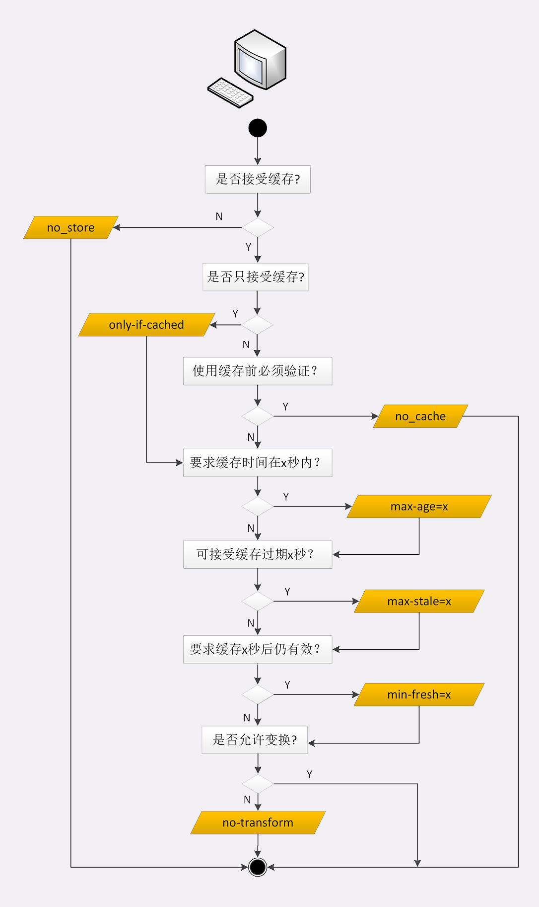

# HTTP的缓存代理

HTTP 传输链路上，不只是客户端有缓存，服务器上的缓存也是非常有价值的，可以让请求不必走完整个后续处理流程，“就近”获得响应结果。

代理服务收到源服务器发来的响应数据后需要做两件事。第一个当然是把报文转发给客户端，而第二个就是把报文存入自己的 Cache 里。

下一次再有相同的请求，代理服务器就可以直接发送 304 或者缓存数据，不必再从源服务器那里获取。这样就降低了客户端的等待时间，同时节约了源服务器的网络带宽。

## 源服务器的缓存控制

介绍了 4 种服务器端的“Cache-Control”属性：max-age、no_store、no_cache 和 must-revalidate，你应该还有印象吧？

这 4 种缓存属性可以约束客户端，也可以约束代理。

但客户端和代理是不一样的，客户端的缓存只是用户自己使用，而代理的缓存可能会为非常多的客户端提供服务。所以，需要对它的缓存再多一些限制条件。

首先，我们要区分客户端上的缓存和代理上的缓存，可以使用两个新属性“**private**”和“**public**”。

“private”表示缓存只能在客户端保存，是用户“私有”的，不能放在代理上与别人共享。而“public”的意思就是缓存完全开放，谁都可以存，谁都可以用。

比如你登录论坛，返回的响应报文里用“Set-Cookie”添加了论坛 ID，这就属于私人数据，不能存在代理上。不然，别人访问代理获取了被缓存的响应就麻烦了。

其次，缓存失效后的重新验证也要区分开（即使用条件请求“Last-modified”和“ETag”），“**must-revalidate**”是只要过期就必须回源服务器验证，而新的“**proxy-revalidate**”只要求代理的缓存过期后必须验证，客户端不必回源，只验证到代理这个环节就行了。

再次，缓存的生存时间可以使用新的“**s-maxage**”（s 是 share 的意思，注意 maxage 中间没有“-”），只限定在代理上能够存多久，而客户端仍然使用“max_age”。

还有一个代理专用的属性“**no-transform**”。代理有时候会对缓存下来的数据做一些优化，比如把图片生成 png、webp 等几种格式，方便今后的请求处理，而“no-transform”就会禁止这样做，不许“偷偷摸摸搞小动作”。

我还要提醒你一点，源服务器在设置完“Cache-Control”后必须要为报文加上“Last-modified”或“ETag”字段。否则，客户端和代理后面就无法使用条件请求来验证缓存是否有效，也就不会有 304 缓存重定向。

## 客户端的缓存控制

关于缓存的生存时间，多了两个新属性“**max-stale**”和“**min-fresh**”。

“max-stale”的意思是如果代理上的缓存过期了也可以接受，但不能过期太多，超过 x 秒也会不要。“min-fresh”的意思是缓存必须有效，而且必须在 x 秒后依然有效。

比如，草莓上贴着标签“max-age=5”，现在已经在冰柜里存了 7 天。如果有请求“max-stale=2”，意思是过期两天也能接受，所以刚好能卖出去。

但要是“min-fresh=1”，这是绝对不允许过期的，就不会买走。这时如果有另外一个菠萝是“max-age=10”，那么“7+1<10”，在一天之后还是新鲜的，所以就能卖出去。

有的时候客户端还会发出一个特别的“**only-if-cached**”属性，表示只接受代理缓存的数据，不接受源服务器的响应。如果代理上没有缓存或者缓存过期，就应该给客户端返回一个 504（Gateway Timeout）。

