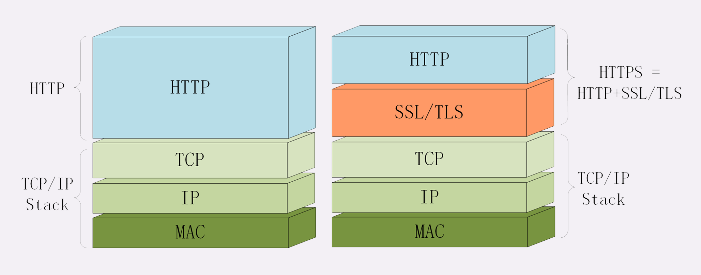

# HTTPS是什么？SSL/TLS又是什么？

## 为什么要有 HTTPS？

## 什么是安全？

通常认为，如果通信过程具备了四个特性，就可以认为是“安全”的，这四个特性是：机密性、完整性，身份认证和不可否认。

**机密性**（Secrecy/Confidentiality）是指对数据的“保密”，只能由可信的人访问，对其他人是不可见的“秘密”，简单来说就是不能让不相关的人看到不该看的东西。

**完整性**（Integrity，也叫一致性）是指数据在传输过程中没有被窜改，不多也不少，“完完整整”地保持着原状。

机密性虽然可以让数据成为“秘密”，但不能防止黑客对数据的修改，黑客可以替换数据，调整数据的顺序，或者增加、删除部分数据，破坏通信过程。

**身份认证**（Authentication）是指确认对方的真实身份，也就是“证明你真的是你”，保证消息只能发送给可信的人。

如果通信时另一方是假冒的网站，那么数据再保密也没有用，黑客完全可以使用冒充的身份“套”出各种信息，加密和没加密一样。

**不可否认**（Non-repudiation/Undeniable），也叫不可抵赖，意思是不能否认已经发生过的行为，不能“说话不算数”“耍赖皮”。

使用前三个特性，可以解决安全通信的大部分问题，但如果缺了不可否认，那通信的事务真实性就得不到保证，有可能出现“老赖”。

## 什么是 HTTPS？

说到这里，终于轮到今天的主角 HTTPS 出场了，它为 HTTP 增加了刚才所说的四大安全特性。

HTTPS 其实是一个“非常简单”的协议，RFC 文档很小，只有短短的 7 页，里面规定了**新的协议名“https”，默认端口号 443**，至于其他的什么请求 - 应答模式、报文结构、请求方法、URI、头字段、连接管理等等都完全沿用 HTTP，没有任何新的东西。

也就是说，除了协议名“http”和端口号 80 这两点不同，HTTPS 协议在语法、语义上和 HTTP 完全一样，优缺点也“照单全收”（当然要除去“明文”和“不安全”）。

你可能要问了，既然没有新东西，HTTPS 凭什么就能做到机密性、完整性这些安全特性呢？

秘密就在于 HTTPS 名字里的“S”，它把 HTTP 下层的传输协议由 TCP/IP 换成了 SSL/TLS，由“**HTTP over TCP/IP**”变成了“**HTTP over SSL/TLS**”，让 HTTP 运行在了安全的 SSL/TLS 协议上（可参考第 4 讲和第 5 讲），收发报文不再使用 Socket API，而是调用专门的安全接口。

## SSL/TLS

SSL 即安全套接层（Secure Sockets Layer），在 OSI 模型中处于第 5 层（会话层），由网景公司于 1994 年发明，有 v2 和 v3 两个版本，而 v1 因为有严重的缺陷从未公开过。

SSL 发展到 v3 时已经证明了它自身是一个非常好的安全通信协议，于是互联网工程组 IETF 在 1999 年把它改名为 TLS（传输层安全，Transport Layer Security），正式标准化，版本号从 1.0 重新算起，所以 TLS1.0 实际上就是 SSLv3.1。

目前应用的最广泛的 TLS 是 1.2，而之前的协议（TLS1.1/1.0、SSLv3/v2）都已经被认为是不安全的，各大浏览器即将在 2020 年左右停止支持，所以接下来的讲解都针对的是 TLS1.2。

浏览器和服务器在使用 TLS 建立连接时需要选择一组恰当的加密算法来实现安全通信，这些算法的组合被称为“**密码套件**”（cipher suite，也叫加密套件）。

如协商选定的是“ECDHE-RSA-AES256-GCM-SHA384”。

这么长的名字看着有点晕吧，不用怕，其实 TLS 的密码套件命名非常规范，格式很固定。基本的形式是“密钥交换算法 + 签名算法 + 对称加密算法 + 摘要算法”，比如刚才的密码套件的意思就是：

“握手时使用 ECDHE 算法进行密钥交换，用 RSA 签名和身份认证，握手后的通信使用 AES 对称算法，密钥长度 256 位，分组模式是 GCM，摘要算法 SHA384 用于消息认证和产生随机数。”

