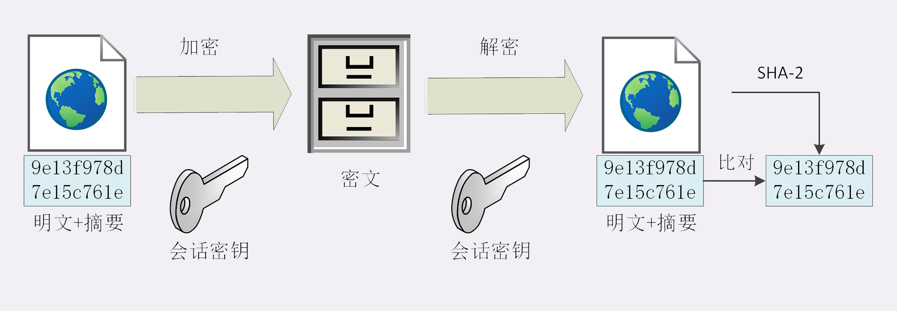
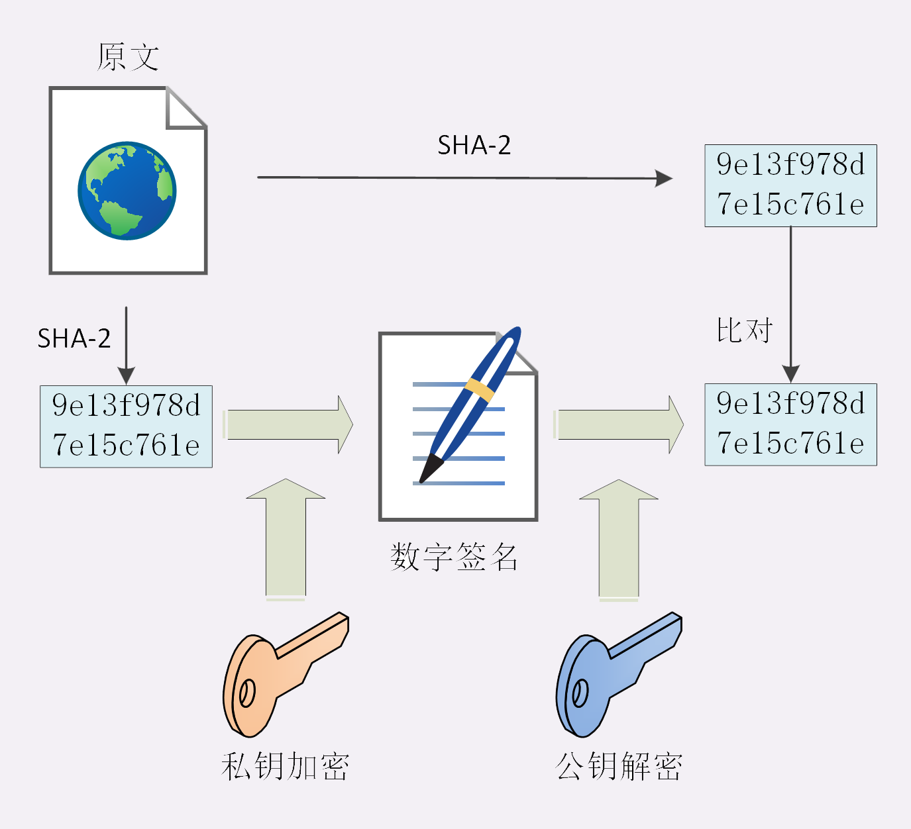

# 数字签名与证书

仅有机密性，离安全还差的很远。

黑客虽然拿不到会话密钥，无法破解密文，但可以通过窃听收集到足够多的密文，再尝试着修改、重组后发给网站。因为没有完整性保证，服务器只能“照单全收”，然后他就可以通过服务器的响应获取进一步的线索，最终就会破解出明文。

另外，黑客也可以伪造身份发布公钥。如果你拿到了假的公钥，混合加密就完全失效了。你以为自己是在和“某宝”通信，实际上网线的另一端却是黑客，银行卡号、密码等敏感信息就在“安全”的通信过程中被窃取了。

所以，在机密性的基础上还必须加上完整性、身份认证等特性，才能实现真正的安全。

## 摘要算法

实现**完整性**的手段主要是**摘要算法**（Digest Algorithm），也就是常说的散列函数、哈希函数（Hash Function）。

你可以把摘要算法近似地理解成一种特殊的压缩算法，它能够把任意长度的数据“压缩”成固定长度、而且独一无二的“摘要”字符串，就好像是给这段数据生成了一个数字“指纹”。

换一个角度，也可以把摘要算法理解成特殊的“单向”加密算法，它只有算法，没有密钥，加密后的数据无法解密，不能从摘要逆推出原文。

摘要算法实际上是把数据从一个“大空间”映射到了“小空间”，所以就存在“冲突”（collision，也叫碰撞）的可能性，就如同现实中的指纹一样，可能会有两份不同的原文对应相同的摘要。好的摘要算法必须能够“抵抗冲突”，让这种可能性尽量地小。

因为摘要算法对输入具有“单向性”和“雪崩效应”，输入的微小不同会导致输出的剧烈变化，所以也被 TLS 用来生成伪随机数（PRF，pseudo random function）。

你一定在日常工作中听过、或者用过 MD5（Message-Digest 5）、SHA-1（Secure Hash Algorithm 1），它们就是最常用的两个摘要算法，能够生成 16 字节和 20 字节长度的数字摘要。但这两个算法的安全强度比较低，不够安全，在 TLS 里已经被禁止使用了。

目前 TLS 推荐使用的是 SHA-1 的后继者：SHA-2。

SHA-2 实际上是一系列摘要算法的统称，总共有 6 种，常用的有 SHA224、SHA256、SHA384，分别能够生成 28 字节、32 字节、48 字节的摘要。

## 完整性

摘要算法保证了“数字摘要”和原文是完全等价的。所以，我们只要在原文后附上它的摘要，就能够保证数据的完整性。

不过摘要算法不具有机密性，如果明文传输，那么黑客可以修改消息后把摘要也一起改了，网站还是鉴别不出完整性。

所以，真正的完整性必须要建立在机密性之上，在混合加密系统里用会话密钥加密消息和摘要，这样黑客无法得知明文，也就没有办法动手脚了。

## 数字签名——身份认证

加密算法结合摘要算法，我们的通信过程可以说是比较安全了。但这里还有漏洞，就是通信的两个端点（endpoint）。

使用私钥再加上摘要算法，就能够实现“**数字签名**”，同时实现“身份认证”和“不可否认”。

但又因为非对称加密效率太低，所以私钥只**加密原文的摘要**，这样运算量就小的多，而且得到的数字签名也很小，方便保管和传输。

## 数字证书和 CA

这里还有一个“**公钥的信任**”问题。因为谁都可以发布公钥，我们还缺少防止黑客伪造公钥的手段，也就是说，怎么来判断这个公钥就是你或者某宝的公钥呢？

CA 对公钥的签名认证也是有格式的，不是简单地把公钥绑定在持有者身份上就完事了，还要包含序列号、用途、颁发者、有效时间等等，把这些打成一个包再签名，完整地证明公钥关联的各种信息，形成“**数字证书**”（Certificate）。

操作系统和浏览器都内置了各大 CA 的根证书，上网的时候只要服务器发过来它的证书，就可以验证证书里的签名，顺着证书链（Certificate Chain）一层层地验证，直到找到根证书，就能够确定证书是可信的，从而里面的公钥也是可信的。

