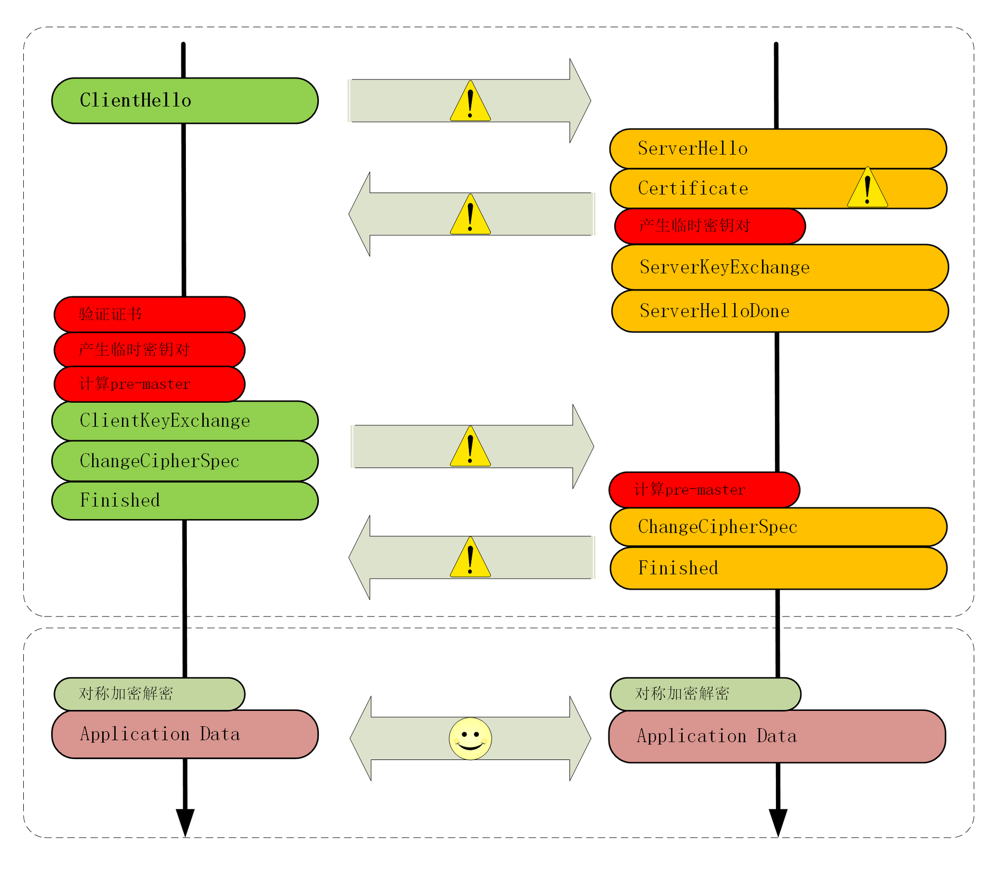

# HTTPS的优化

你可能或多或少听别人说过，“HTTPS 的连接很慢”。那么“慢”的原因是什么呢？

通过前两讲的学习，你可以看到，HTTPS 连接大致上可以划分为两个部分，第一个是建立连接时的**非对称加密握手**，第二个是握手后的**对称加密报文传输**。

由于目前流行的 AES、ChaCha20 性能都很好，还有硬件优化，报文传输的性能损耗可以说是非常地小，小到几乎可以忽略不计了。所以，通常所说的“HTTPS 连接慢”指的就是刚开始建立连接的那段时间。

在 TCP 建连之后，正式数据传输之前，HTTPS 比 HTTP 增加了一个 TLS 握手的步骤，这个步骤最长可以花费两个消息往返，也就是 2-RTT。而且在握手消息的网络耗时之外，还会有其他的一些“隐形”消耗，比如：

- 产生用于密钥交换的临时公私钥对（ECDHE）；
- 验证证书时访问 CA 获取 CRL 或者 OCSP；
- 非对称加密解密处理“Pre-Master”。

不过刚才说的情况早就是“过去时”了，现在已经有了很多行之有效的 HTTPS 优化手段，运用得好可以把连接的额外耗时降低到几十毫秒甚至是“零”。

我画了一张图，把 TLS 握手过程中影响性能的部分都标记了出来，对照着它就可以“有的放矢”地来优化 HTTPS。

