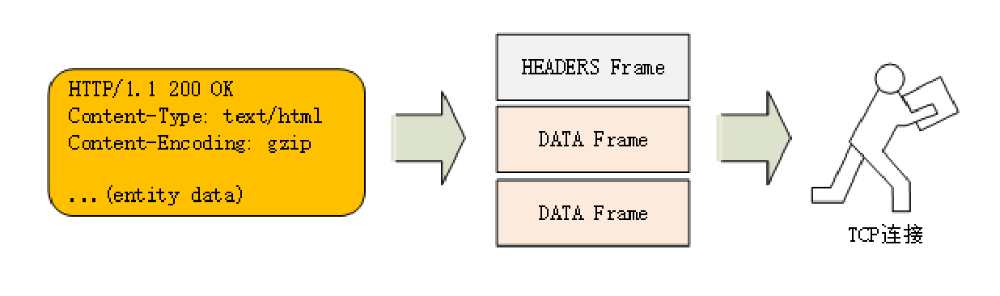
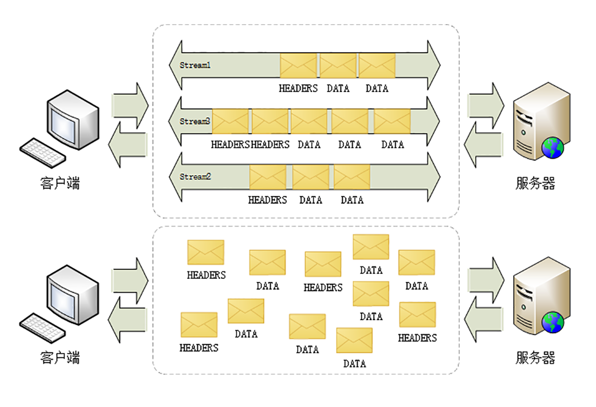
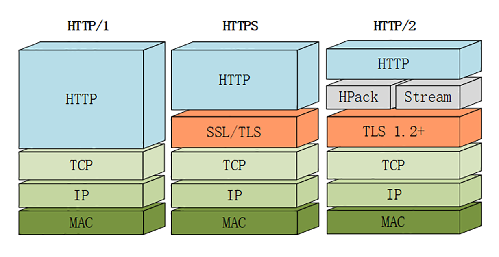

# HTTP/2特性概览

由于 HTTPS 已经在安全方面做的非常好了，所以 HTTP/2 的唯一目标就是改进性能。

## 头部压缩

HTTP/1 里可以用头字段“Content-Encoding”指定 Body 的编码方式，比如用 gzip 压缩来节约带宽，但报文的另一个组成部分——Header 却被无视了，没有针对它的优化手段。

HTTP/2 并没有使用传统的压缩算法，而是开发了专门的“**HPACK**”算法，在客户端和服务器两端建立“字典”，用索引号表示重复的字符串，还釆用哈夫曼编码来压缩整数和字符串，可以达到 50%~90% 的高压缩率。

## 二进制格式

你可能已经很习惯于 HTTP/1 里纯文本形式的报文了，它的优点是“一目了然”，用最简单的工具就可以开发调试，非常方便。

但 HTTP/2 在这方面没有“妥协”，决定改变延续了十多年的现状，不再使用肉眼可见的 ASCII 码，而是向下层的 TCP/IP 协议“靠拢”，全面采用二进制格式。

这样虽然对人不友好，但却大大方便了计算机的解析。原来使用纯文本的时候容易出现多义性，比如大小写、空白字符、回车换行、多字少字等等，程序在处理时必须用复杂的状态机，效率低，还麻烦。

而二进制里只有“0”和“1”，可以严格规定字段大小、顺序、标志位等格式，“对就是对，错就是错”，解析起来没有歧义，实现简单，而且体积小、速度快，做到“内部提效”。

以二进制格式为基础，HTTP/2 就开始了“大刀阔斧”的改革。

它把 TCP 协议的部分特性挪到了应用层，把原来的“Header+Body”的消息“打散”为数个小片的**二进制“帧”**（Frame），用“HEADERS”帧存放头数据、“DATA”帧存放实体数据。

这种做法有点像是“Chunked”分块编码的方式（参见[第 16 讲](https://time.geekbang.org/column/article/104456)），也是“化整为零”的思路，但 HTTP/2 数据分帧后“Header+Body”的报文结构就完全消失了，协议看到的只是一个个的“碎片”。

## 虚拟的“流”

消息的“碎片”到达目的地后应该怎么组装起来呢？

HTTP/2 为此定义了一个“**流**”（Stream）的概念，**它是二进制帧的双向传输序列**，同一个消息往返的帧会分配一个唯一的流 ID。你可以想象把它成是一个虚拟的“数据流”，在里面流动的是一串有先后顺序的数据帧，这些数据帧按照次序组装起来就是 HTTP/1 里的请求报文和响应报文。

因为“流”是虚拟的，实际上并不存在，所以 HTTP/2 就可以在一个 TCP 连接上用“**流**”同时发送多个“碎片化”的消息，这就是常说的“**多路复用**”（ Multiplexing）——多个往返通信都复用一个连接来处理。

在“流”的层面上看，消息是一些有序的“帧”序列，而在“连接”的层面上看，消息却是乱序收发的“帧”。多个请求 / 响应之间没有了顺序关系，不需要排队等待，也就不会再出现“队头阻塞”问题，降低了延迟，大幅度提高了连接的利用率。

为了更好地利用连接，加大吞吐量，HTTP/2 还添加了一些控制帧来管理虚拟的“流”，实现了优先级和流量控制，这些特性也和 TCP 协议非常相似。

HTTP/2 还在一定程度上改变了传统的“请求 - 应答”工作模式，服务器不再是完全被动地响应请求，也可以新建“流”主动向客户端发送消息。比如，在浏览器刚请求 HTML 的时候就提前把可能会用到的 JS、CSS 文件发给客户端，减少等待的延迟，这被称为“**服务器推送**”（Server Push，也叫 Cache Push）。

## 强化安全

出于兼容的考虑，HTTP/2 延续了 HTTP/1 的“明文”特点，可以像以前一样使用明文传输数据，不强制使用加密通信，不过格式还是二进制，只是不需要解密。

但由于 HTTPS 已经是大势所趋，而且主流的浏览器 Chrome、Firefox 等都公开宣布只支持加密的 HTTP/2，所以“事实上”的 HTTP/2 是加密的。也就是说，互联网上通常所能见到的 HTTP/2 都是使用“https”协议名，跑在 TLS 上面。

为了区分“加密”和“明文”这两个不同的版本，HTTP/2 协议定义了两个字符串标识符：“h2”表示加密的 HTTP/2，“h2c”表示明文的 HTTP/2，多出的那个字母“c”的意思是“clear text”。

## 协议栈

下面的这张图对比了 HTTP/1、HTTPS 和 HTTP/2 的协议栈，你可以清晰地看到，HTTP/2 是建立在“HPack”“Stream”“TLS1.2”基础之上的，比 HTTP/1、HTTPS 复杂了一些。

## 小结

头部压缩

二进制（帧和流，多路复用，服务端推送）

安全