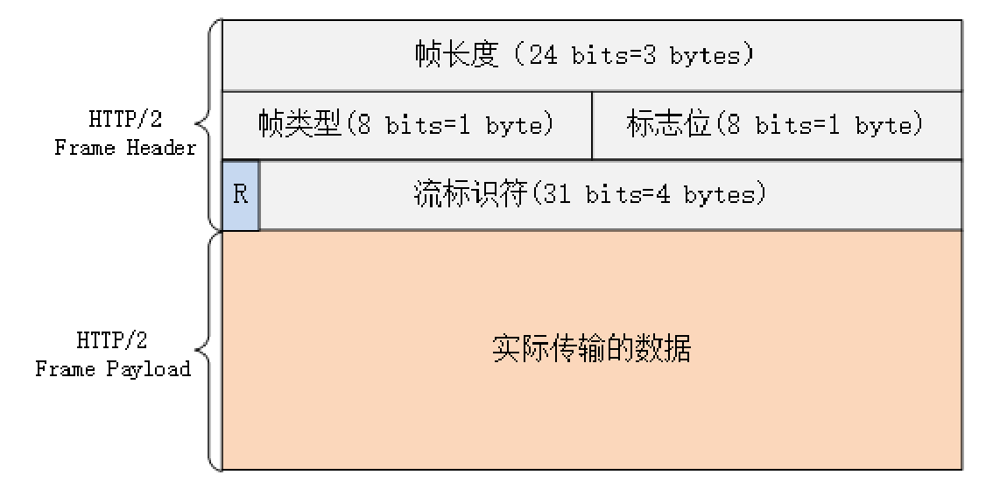

# HTTP/2内核剖析

## 连接前言

由于 HTTP/2“事实上”是基于 TLS，所以在正式收发数据之前，会有 TCP 握手和 TLS 握 手，这两个步骤相信你一定已经很熟悉了，所以这里就略过去不再细说。 TLS 握手成功之后，客户端必须要发送一个“连接前言”（connection preface），用来 确认建立 HTTP/2 连接。

## 头部压缩

为了方便管理和压缩，HTTP/2 废除了原有的起始行概念，把起始行里面的请求方法、 URI、状态码等统一转换成了头字段的形式，并且给这些“不是头字段的头字段”起了个特 别的名字——“伪头字段”（pseudo-header fields）。而起始行里的版本号和错误原因 短语因为没什么大用，顺便也给废除了。

## 二进制帧

头部数据压缩之后，HTTP/2 就要把报文拆成二进制的帧准备发送。

报文头里最后 4 个字节是**流标识符**，也就是帧所属的“流”，接收方使用它就可以从乱序的帧里识别出具有相同流 ID 的帧序列，按顺序组装起来就实现了虚拟的“流”。

## 流与多路复用

**流是二进制帧的双向传输序列**。

在 HTTP/2 连接上，虽然帧是乱序收发的，但只要它们都拥有相同的流 ID，就都属于一个流，而且在这个流里帧不是无序的，而是有着严格的先后顺序。

在概念上，一个 HTTP/2 的流就等同于一个 HTTP/1 里的“请求 - 应答”。在 HTTP/1 里一个“请求 - 响应”报文来回是一次 HTTP 通信，在 HTTP/2 里一个流也承载了相同的功能。

HTTP/2 的流有哪些特点呢？我给你简单列了一下：

1. 流是可并发的，一个 HTTP/2 连接上可以同时发出多个流传输数据，也就是并发多请求，实现“多路复用”；
2. 客户端和服务器都可以创建流，双方互不干扰；
3. 流是双向的，一个流里面客户端和服务器都可以发送或接收数据帧，也就是一个“请求 - 应答”来回；
4. 流之间没有固定关系，彼此独立，但流内部的帧是有严格顺序的；
5. 流可以设置优先级，让服务器优先处理，比如先传 HTML/CSS，后传图片，优化用户体验；
6. 流 ID 不能重用，只能顺序递增，客户端发起的 ID 是奇数，服务器端发起的 ID 是偶数；
7. 在流上发送“RST_STREAM”帧可以随时终止流，取消接收或发送；
8. 第 0 号流比较特殊，不能关闭，也不能发送数据帧，只能发送控制帧，用于流量控制。

HTTP/2 在一个连接上使用多个流收发数据，那么它本身默认就会是长连接，所以永远不需要“Connection”头字段（keepalive 或 close）。

下载大文件的时候想取消接收，在 HTTP/1 里只能断开 TCP 连接重新“三次握手”，成本很高，而在 HTTP/2 里就可以简单地发送一个“RST_STREAM”中断流，而长连接会继续保持。

### 流状态转换

流很重要，也很复杂。为了更好地描述运行机制，HTTP/2 借鉴了 TCP，根据帧的标志位实现流状态转换。当然，这些状态也是虚拟的，只是为了辅助理解。