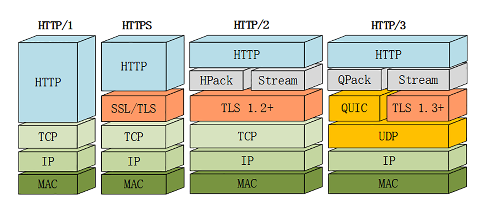

# HTTP/3展望

## HTTP/2 的“队头阻塞”

等等，你可能要发出疑问了：为什么说是“基本上”，而不是“完全”解决了呢？

这是因为 HTTP/2 虽然使用“帧”“流”“多路复用”，没有了“队头阻塞”，但这些手段都是在应用层里，而在下层，也就是 TCP 协议里，还是会发生“队头阻塞”。

而 TCP 为了保证可靠传输，有个特别的“丢包重传”机制，丢失的包必须要等待重新传输确认，其他的包即使已经收到了，也只能放在缓冲区里，上层的应用拿不出来，只能“干着急”。

## QUIC 协议

从这张图里，你可以看到 HTTP/3 有一个关键的改变，那就是它把下层的 TCP“抽掉”了，换成了 UDP。因为 UDP 是无序的，包之间没有依赖关系，所以就从根本上解决了“队头阻塞”。

你一定知道，UDP 是一个简单、不可靠的传输协议，只是对 IP 协议的一层很薄的包装，和 TCP 相比，它实际应用的较少。

不过正是因为它简单，不需要建连和断连，通信成本低，也就非常灵活、高效，“可塑性”很强。

所以，QUIC 就选定了 UDP，在它之上把 TCP 的那一套连接管理、拥塞窗口、流量控制等“搬”了过来，“去其糟粕，取其精华”，打造出了一个全新的可靠传输协议，可以认为是“**新时代的 TCP**”。

### QUIC 的特点

QUIC 基于 UDP，而 UDP 是“无连接”的，根本就不需要“握手”和“挥手”，所以天生就要比 TCP 快。

就像 TCP 在 IP 的基础上实现了可靠传输一样，QUIC 也基于 UDP 实现了可靠传输，保证数据一定能够抵达目的地。它还引入了类似 HTTP/2 的“流”和“多路复用”，单个“流”是有序的，可能会因为丢包而阻塞，但其他“流”不会受到影响。

HTTP/2中，多个请求是跑在一个TCP管道中的。但当出现了丢包时，HTTP/2 的表现反倒不如 HTTP/1 了。因为TCP为了保证可靠传输，有个特别的“丢包重传”机制，丢失的包必须要等待重新传输确认，HTTP/2出现丢包时，整个 TCP 都要开始等待重传，那么就会阻塞该TCP连接中的所有请求。而对于 HTTP/1.1 来说，可以开启多个 TCP 连接，出现这种情况反到只会影响其中一个连接，剩余的 TCP 连接还可以正常传输数据。

为了防止网络上的中间设备（Middle Box）识别协议的细节，QUIC 全面采用加密通信，可以很好地抵御窜改和“协议僵化”（ossification）。