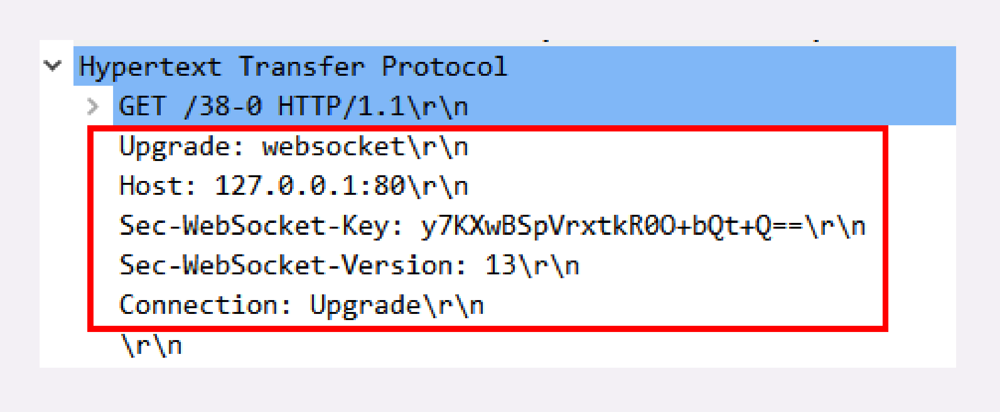

# WebSocket

单从名字上看，“Web”指的是 HTTP，“Socket”是套接字调用，那么这两个连起来又是什么意思呢？

所谓“望文生义”，大概你也能猜出来，“WebSocket”就是运行在“Web”，也就是 HTTP 上的 Socket 通信规范，提供与“TCP Socket”类似的功能，使用它就可以像“TCP Socket”一样调用下层协议栈，任意地收发数据。

## 为什么要有 WebSocket

其实 WebSocket 与 HTTP/2 一样，都是为了解决 HTTP 某方面的缺陷而诞生的。HTTP/2 针对的是“队头阻塞”，而 WebSocket 针对的是“请求 - 应答”通信模式。

那么，“请求 - 应答”有什么不好的地方呢？

“请求 - 应答”是一种“**半双工**”的通信模式，虽然可以双向收发数据，但同一时刻只能一个方向上有动作，传输效率低。更关键的一点，它是一种“**被动**”通信模式，服务器只能“被动”响应客户端的请求，无法主动向客户端发送数据。

虽然后来的 HTTP/2、HTTP/3 新增了 Stream、Server Push 等特性，但“请求 - 应答”依然是主要的工作方式。这就导致 HTTP 难以应用在动态页面、即时消息、网络游戏等要求“**实时通信**”的领域。

## WebSocket 的特点

WebSocket 是一个真正“**全双工**”的通信协议，与 TCP 一样，客户端和服务器都可以随时向对方发送数据，而不用像 HTTP“你拍一，我拍一”那么“客套”。于是，服务器就可以变得更加“主动”了。一旦后台有新的数据，就可以立即“推送”给客户端，不需要客户端轮询，“实时通信”的效率也就提高了。

WebSocket 采用了二进制帧结构，语法、语义与 HTTP 完全不兼容，但因为它的主要运行环境是浏览器，为了便于推广和应用，就不得不“搭便车”，在使用习惯上尽量向 HTTP 靠拢，这就是它名字里“Web”的含义。

服务发现方面，WebSocket 没有使用 TCP 的“IP 地址 + 端口号”，而是延用了 HTTP 的 URI 格式，但开头的协议名不是“http”，引入的是两个新的名字：“**ws**”和“**wss**”，分别表示明文和加密的 WebSocket 协议。

WebSocket 的默认端口也选择了 80 和 443，因为现在互联网上的防火墙屏蔽了绝大多数的端口，只对 HTTP 的 80、443 端口“放行”，所以 WebSocket 就可以“伪装”成 HTTP 协议，比较容易地“穿透”防火墙，与服务器建立连接。具体是怎么“伪装”的，我稍后再讲。

要注意的一点是，WebSocket 的名字容易让人产生误解，虽然大多数情况下我们会在浏览器里调用 API 来使用 WebSocket，但它不是一个“调用接口的集合”，而是一个通信协议，所以我觉得把它理解成“**TCP over Web**”会更恰当一些。

## WebSocket 的帧结构

刚才说了，WebSocket 用的也是二进制帧，有之前 HTTP/2、HTTP/3 的经验，相信你这次也能很快掌握 WebSocket 的报文结构。

不过 WebSocket 和 HTTP/2 的关注点不同，WebSocket 更**侧重于“实时通信”**，而 HTTP/2 更侧重于提高传输效率，所以两者的帧结构也有很大的区别。

WebSocket 虽然有“帧”，但却没有像 HTTP/2 那样定义“流”，也就不存在“多路复用”“优先级”等复杂的特性，而它自身就是“全双工”的，也就不需要“服务器推送”。所以综合起来，WebSocket 的帧学习起来会简单一些。

## WebSocket 的握手

和 TCP、TLS 一样，WebSocket 也要有一个握手过程，然后才能正式收发数据。

这里它还是搭上了 HTTP 的“便车”，利用了 HTTP 本身的“协议升级”特性，“伪装”成 HTTP，这样就能绕过浏览器沙盒、网络防火墙等等限制，这也是 WebSocket 与 HTTP 的另一个重要关联点。

WebSocket 的握手是一个标准的 HTTP GET 请求，但要带上两个协议升级的专用头字段：

- “Connection: Upgrade”，表示要求协议“升级”；
- “Upgrade: websocket”，表示要“升级”成 WebSocket 协议。

另外，为了防止普通的 HTTP 消息被“意外”识别成 WebSocket，握手消息还增加了两个额外的认证用头字段（所谓的“挑战”，Challenge）：

- Sec-WebSocket-Key：一个 Base64 编码的 16 字节随机数，作为简单的认证密钥；
- Sec-WebSocket-Version：协议的版本号，当前必须是 13。

服务器收到 HTTP 请求报文，看到上面的四个字段，就知道这不是一个普通的 GET 请求，而是 WebSocket 的升级请求，于是就不走普通的 HTTP 处理流程，而是构造一个特殊的“101 Switching Protocols”响应报文，通知客户端，接下来就不用 HTTP 了，全改用 WebSocket 协议通信。（有点像 TLS 的“Change Cipher Spec”）

WebSocket 的握手响应报文也是有特殊格式的，要用字段“Sec-WebSocket-Accept”验证客户端请求报文，同样也是为了防止误连接。

具体的做法是把请求头里“Sec-WebSocket-Key”的值，加上一个专用的 UUID “258EAFA5-E914-47DA-95CA-C5AB0DC85B11”，再计算 SHA-1 摘要。

客户端收到响应报文，就可以用同样的算法，比对值是否相等，如果相等，就说明返回的报文确实是刚才握手时连接的服务器，认证成功。

握手完成，后续传输的数据就不再是 HTTP 报文，而是 WebSocket 格式的二进制帧了。

## 小结

浏览器是一个“沙盒”环境，有很多的限制，不允许建立 TCP 连接收发数据，而有了 WebSocket，我们就可以在浏览器里与服务器直接建立“TCP 连接”，获得更多的自由。

## HTTP/2 和 WebSocket的区别

- HTTP/2 针对的是“队头阻塞”，而 WebSocket 针对的是“请求 - 应答”通信模式。“请求 - 应答”是一种“**半双工**”的通信模式，虽然可以双向收发数据，但同一时刻只能一个方向上有动作，传输效率低。更关键的一点，它是一种“**被动**”通信模式，服务器只能“被动”响应客户端的请求，无法主动向客户端发送数据。

- HTTP2虽然支持服务器推送资源到客户端，但那不是应用程序可以感知的，主要是让浏览器（用户代理）提前缓存静态资源，所以我们不能指望HTTP2可以像WebSocket建立双向实时通信。