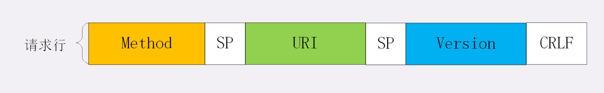

### HTTP 协议的核心部分是什么呢？

答案就是它传输的报文内容。

HTTP 协议在规范文档里详细定义了报文的格式，规定了组成部分，解析规则，还有处理策略，所以可以在 TCP/IP 层之上实现更灵活丰富的功能，例如连接控制，缓存管理、数据编码、内容协商等等。

## 报文结构

HTTP 协议的请求报文和响应报文的结构基本相同，由三大部分组成：

1. 起始行（start line）：描述请求或响应的基本信息；
2. 头部字段集合（header）：使用 key-value 形式更详细地说明报文；
3. 消息正文（entity）：实际传输的数据，它不一定是纯文本，可以是图片、视频等二进制数据。

这其中前两部分起始行和头部字段经常又合称为“**请求头**”或“**响应头**”，消息正文又称为“**实体**”，但与“**header**”对应，很多时候就直接称为“**body**”。

HTTP 协议规定报文必须有 header，但可以没有 body，而且在 header 之后必须要有一个“空行”，也就是“CRLF”，十六进制的“0D0A”。

- ### 请求行

请求行由三部分构成：

1. 请求方法：是一个动词，如 GET/POST，表示对资源的操作；
2. 请求目标：通常是一个 URI，标记了请求方法要操作的资源；
3. 版本号：表示报文使用的 HTTP 协议版本。

- ### 状态行

比起请求行来说，状态行要简单一些，同样也是由三部分构成：

1. 版本号：表示报文使用的 HTTP 协议版本；
2. 状态码：一个三位数，用代码的形式表示处理的结果，比如 200 是成功，500 是服务器错误；
3. 原因：作为数字状态码补充，是更详细的解释文字，帮助人理解原因。

- ### 头部字段

使用头字段需要注意下面几点：

1. 字段名不区分大小写，例如“Host”也可以写成“host”，但首字母大写的可读性更好；
2. 字段名里不允许出现空格，可以使用连字符“-”，但不能使用下划线“_”。例如，“test-name”是合法的字段名，而“test name”“test_name”是不正确的字段名；
3. 字段名后面必须紧接着“:”，不能有空格，而“:”后的字段值前可以有多个空格；
4. 字段的顺序是没有意义的，可以任意排列不影响语义；
5. 字段原则上不能重复，除非这个字段本身的语义允许，例如 Set-Cookie。

#### 常用头字段

HTTP 协议规定了非常多的头部字段，实现各种各样的功能，但基本上可以分为四大类：

1. 通用字段：在请求头和响应头里都可以出现；
2. 请求字段：仅能出现在请求头里，进一步说明请求信息或者额外的附加条件；
3. 响应字段：仅能出现在响应头里，补充说明响应报文的信息；
4. 实体字段：它实际上属于通用字段，但专门描述 body 的额外信息。

实体字段里要说的一个是**Content-Length**，它表示报文里 body 的长度，也就是请求头或响应头空行后面数据的长度。服务器看到这个字段，就知道了后续有多少数据，可以直接接收。如果没有这个字段，那么 body 就是不定长的，需要使用 chunked 方式分段传输。