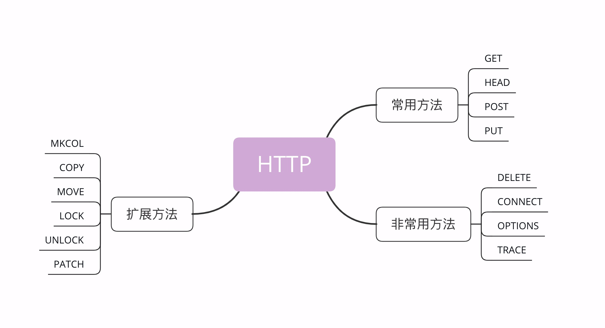

## 方法

目前 HTTP/1.1 规定了八种方法，单词**都必须是大写的形式**，我先简单地列把它们列出来，后面再详细讲解。

1. GET：获取资源，可以理解为读取或者下载数据；
2. HEAD：获取资源的元信息；
3. POST：向资源提交数据，相当于写入或上传数据；
4. PUT：类似 POST；
5. DELETE：删除资源；
6. CONNECT：建立特殊的连接隧道；
7. OPTIONS：列出可对资源实行的方法；
8. TRACE：追踪请求 - 响应的传输路径。

- ### GET/HEAD

**HEAD**方法与 GET 方法类似，也是请求从服务器获取资源，服务器的处理机制也是一样的，但服务器不会返回请求的实体数据，只会传回响应头，也就是资源的“元信息”。

- ### POST/PUT

POST 也是一个经常用到的请求方法，使用频率应该是仅次于 GET，应用的场景也非常多，只要向服务器发送数据，用的大多数都是 POST。

PUT 的作用与 POST 类似，也可以向服务器提交数据，但与 POST 存在微妙的不同，通常 POST 表示的是“新建”“create”的含义，而 PUT 则是“修改”“update”的含义。

- ### 其他不常用方法

**DELETE**方法指示服务器删除资源，因为这个动作危险性太大，所以通常服务器不会执行真正的删除操作，而是对资源做一个删除标记。当然，更多的时候服务器就直接不处理 DELETE 请求。

**CONNECT**是一个比较特殊的方法，要求服务器为客户端和另一台远程服务器建立一条特殊的连接隧道，这时 Web 服务器在中间充当了代理的角色。

**OPTIONS**方法要求服务器列出可对资源实行的操作方法，在响应头的 Allow 字段里返回。它的功能很有限，用处也不大，有的服务器（例如 Nginx）干脆就没有实现对它的支持。

**TRACE**方法多用于对 HTTP 链路的测试或诊断，可以显示出请求 - 响应的传输路径。它的本意是好的，但存在漏洞，会泄漏网站的信息，所以 Web 服务器通常也是禁止使用。

## 安全与幂等

在 HTTP 协议里，所谓的“**安全**”是指请求方法不会“破坏”服务器上的资源，即不会对服务器上的资源造成实质的修改。

按照这个定义，只有 GET 和 HEAD 方法是“安全”的，因为它们是“只读”操作，只要服务器不故意曲解请求方法的处理方式，无论 GET 和 HEAD 操作多少次，服务器上的数据都是“安全的”。

所谓的“**幂等**”实际上是一个数学用语，被借用到了 HTTP 协议里，意思是多次执行相同的操作，结果也都是相同的，即多次“幂”后结果“相等”。

很显然，GET 和 HEAD 既是安全的也是幂等的，DELETE 可以多次删除同一个资源，效果都是“资源不存在”，所以也是幂等的。

按照 RFC 里的语义，POST 是“新增或提交数据”，多次提交数据会创建多个资源，所以不是幂等的；而 PUT 是“替换或更新数据”，多次更新一个资源，资源还是会第一次更新的状态，所以是幂等的。