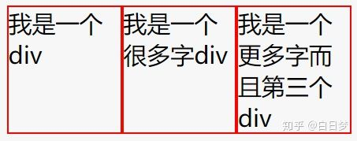
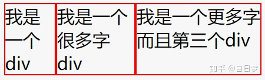

# css相关

- 如何垂直水平居中

- `flex: 0 1 auto;` 是什么意思？

  `flex`属性是`flex-grow`, `flex-shrink` 和 `flex-basis`的简写，默认值为`0 1 auto`。后两个属性可选。

  **flex：1**

  flex: 1; === flex: 1 1

  

  **flex: auto**

  flex: auto === flex: 1 1 auto;

  auto, 根据内容大小缩放

  

  auto 为表示项目本身的大小, **如果设置为 auto, 那么这三个盒子就会按照自己内容的多少来等比例的放大和缩小**, 所以出现了上图中三个盒子不一样大的情况

- less 的 & 代表什么？

- css 优先级

- 避免 css 全局污染。

  > 我常用的 css modules

- css modules 的原理

  > 生成唯一的类名

- 有一个 a 标签，如何动态的决定他的样式。

  > 我说了先写几个 css，然后外部传一个前缀的方式。面试官问了都要这样吗？我说可以通过 context 的方式，就不需要每个组件都传了。
  
- bfc