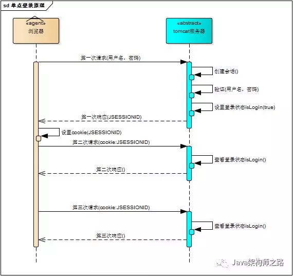
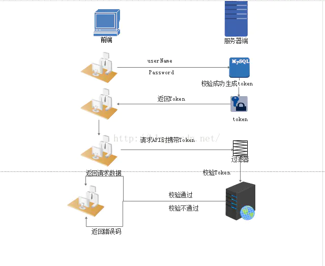
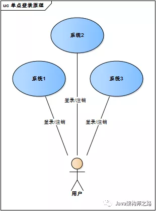
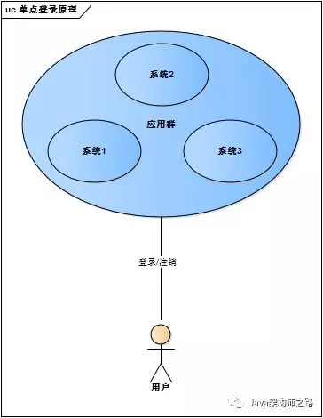
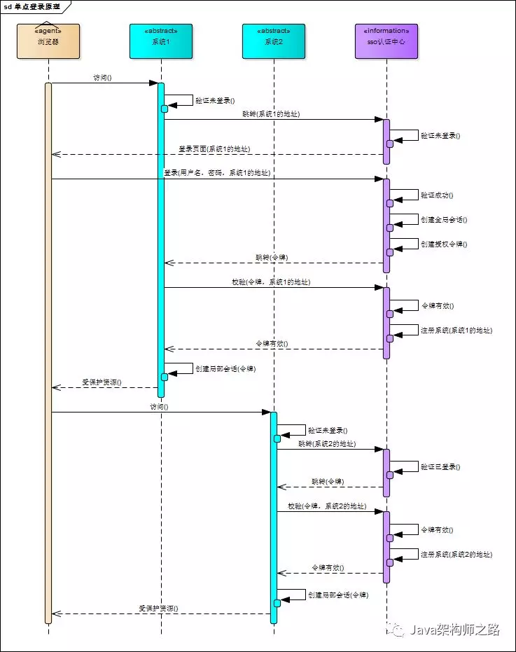
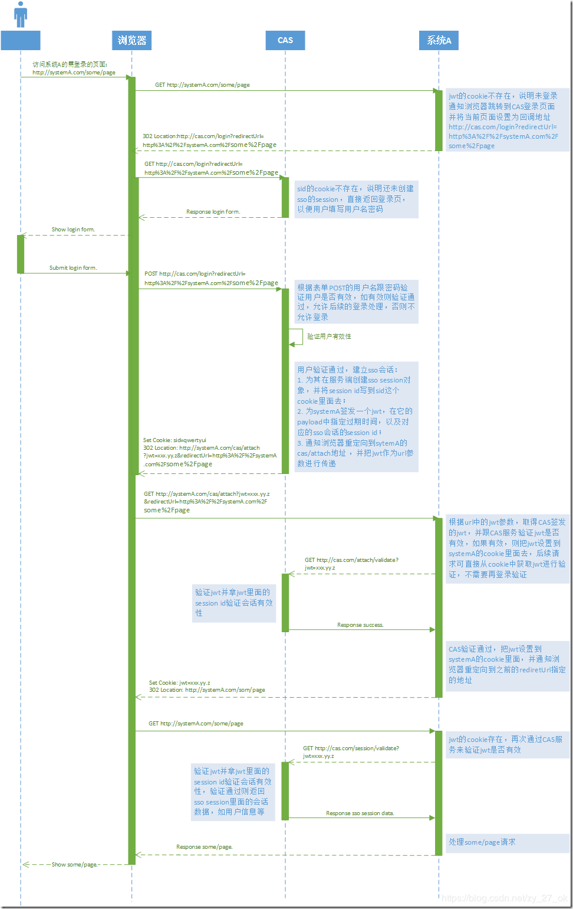
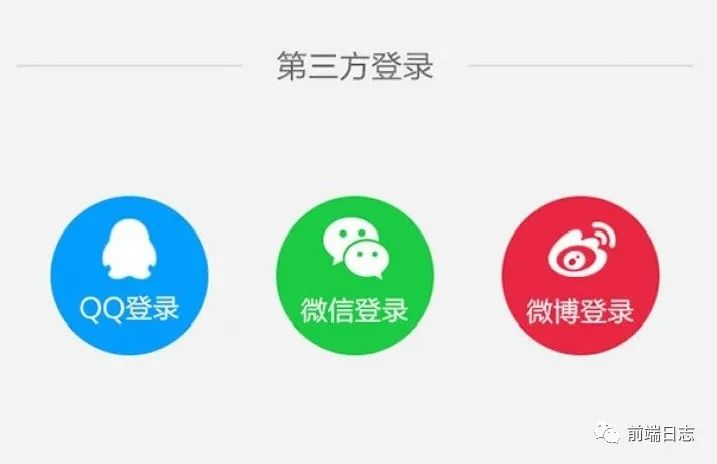
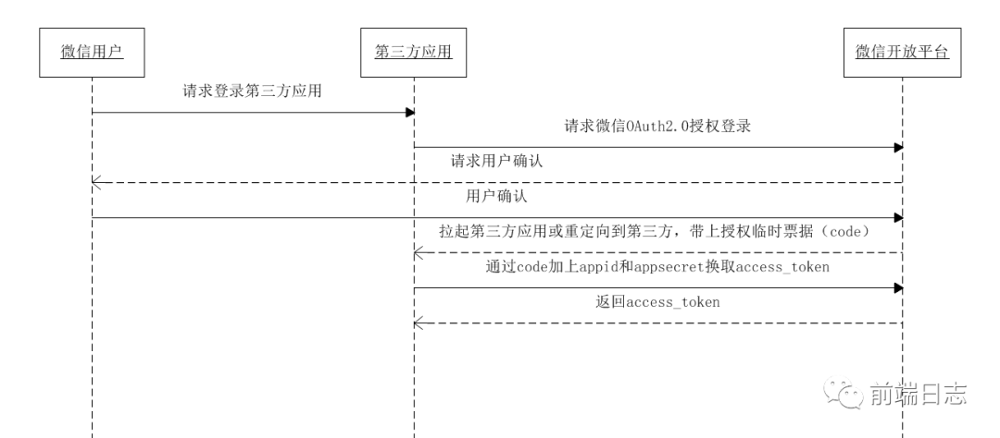

# 登录方案

#### 介绍几种常用的登录方式

- Cookie + Session 登录
- Token 登录
- SSO 单点登录
- OAuth 第三方登录

#### 分类

- 单系统登录
- 多系统单点登录

## 1.Cookie + Session

**单系统登录机制。**

既然http协议无状态，那就让服务器和浏览器共同维护一个状态吧！这就是会话机制。

`Cookie`保存在客户端浏览器中，而`Session`保存在服务器上。客户端浏览器访问服务器的时候，服务器把客户端信息以某种形式记录在服务器上。这就是`Session`。客户端浏览器再次访问时只需要从该`Session`中查找该客户的状态就可以了。

如果说`Cookie`机制是通过检查客户身上的“通行证”来确定客户身份的话，那么`Session`机制就是通过检查服务器上的“客户明细表”来确认客户身份。

#### 会话机制

#### 过程描述

1. 用户访问 `a.com/pageA`，并输入密码登录。（登录）
2. 服务器验证密码无误后，会创建 SessionId，并将它保存起来。（创建会话）
3. 服务器端响应这个 HTTP 请求，并通过 Set-Cookie 头信息，将 SessionId 写入 Cookie 中。（set cookie 返回sessionId）
4. 后续的访问就可以直接使用 Cookie 进行身份验证了。（cookie带sessionId请求，服务器验证登录态）

#### 存在问题

- 由于服务器端需要对接大量的客户端，也就需要存放大量的 SessionId，这样会导致服务器压力过大。
- 如果服务器端是一个集群，为了同步登录态，需要将 SessionId 同步到每一台机器上，无形中增加了服务器端维护成本。
- 由于 SessionId 存放在 Cookie 中，所以无法避免 CSRF 攻击。
- 适用单域名系统或系统群登录。

## 2.Token

Token，访问资源的凭据。

#### Token机制特点

- 服务器端不需要存放 Token，所以不会对服务器端造成压力，即使是服务器集群，也不需要增加维护成本。
- Token 可以存放在前端任何地方，可以不用保存在 Cookie 中，提升了页面的安全性。
- Token 下发之后，只要在生效时间之内，就一直有效，如果服务器端想收回此 Token 的权限，并不容易。

#### 过程描述

1. 用户输入账号密码，并点击登录。
2. 服务器端验证账号密码无误，创建 Token。
3. 服务器端将 Token 返回给客户端，由***客户端自由保存***，localStorage或者其他。
4. 后续页面访问时，带上第一次登录时获取的 Token，服务器端验证 Token ，有效则身份验证成功。

#### Token生成

最常见的 Token 生成方式是使用 JWT（Json Web Token），它是一种简洁的，自包含的方法用于通信双方之间以 JSON 对象的形式安全的传递信息。

#### 路由处理

访问登录之外的页面，都需要登录权限。比如首页，判断是否存在token，有就访问成功，没有则跳转到登录页面。

页面路由跳转过程中，会使用全局钩子`router.beforeEach`中拦截路由，检测到没有`token`就重定向至登录页面。

#### JWT

JWT 算法主要分为 3 个部分：header（头信息），playload（消息体），signature（签名）。

header 部分指定了该 JWT 使用的签名算法。

playload 部分指定信息。

signature 部分为 JWT 的签名，主要为了让 JWT 不能被随意篡改。

#### 问题

- 怎么退出登录？未过期的Token还是可以用，同时多个有效Token？

方案一：

redis记录退出的Token？定时器定时清除Token，清除对象为已进入清除名单，且时间超过Token有效期的Token。

***resdis挂机怎么办？名单不就没了吗？***可以其他DB，就是性能可能差一些。

方案二：

生效的Token都存到redis，退出登录时，清掉退出失效的Token。另外，定时器扫描并清除过期的Token。验证Token有效性的过程变为，有效期内+redis中存有。

***违背了 JWT 的无状态原则（这不就和 session 一样了么？）。***

- 修改密码呢？多台设备怎么同步重新登录？

方案一（配合上面的方案二）：

也要记录userId对应的信息？userId记录对应的有效开始时间（改密码的时间）。记录的生存期是Token的有效期。

方案二：

redis，key-value，存Token - info。信息包括用户信息。修改密码就查一遍redis，把用户对应的token都删除了。

## 3.SSO(Single Sign On)单点登录

分单个根域名和多个根域名的情况。

#### 多系统的复杂性

web系统由单系统发展成多系统组成的应用群，复杂性应该由系统内部承担，而不是用户。无论web系统内部多么复杂，对用户而言，都是一个统一的整体，也就是说，用户访问web系统的整个应用群与访问单个系统一样，登录/注销只要一次就够了。

#### cookie方式存在问题

- 跨域，应用群域名得统一（所有子系统的域名统一在一个顶级域名下）
- 应用群各系统使用的技术（至少是web服务器）要相同，不然cookie的key值（tomcat为JSESSIONID）不同，无法维持会话，共享cookie的方式是无法实现跨语言技术平台登录的，比如java、php、.net系统之间
- cookie本身不安全

#### 实现机制

流程：

1. 用户访问系统1的受保护资源，系统1发现用户未登录，跳转至sso认证中心，并将自己的地址作为参数
2. sso认证中心发现用户未登录，将用户引导至登录页面
3. 用户输入用户名密码提交登录申请
4. sso认证中心校验用户信息，创建用户与sso认证中心之间的会话，称为全局会话，同时创建授权令牌
5. sso认证中心***带着令牌跳转会最初的请求地址***（系统1）
6. 系统1拿到令牌，去sso认证中心校验令牌是否有效
7. sso认证中心校验令牌，返回有效，注册系统1
8. 系统1使用该令牌创建与用户的会话，称为局部会话，返回受保护资源
9. 用户访问系统2的受保护资源
10. 系统2发现用户未登录，跳转至sso认证中心，并将自己的地址作为参数
11. sso认证中心发现用户已登录，跳转回系统2的地址，并附上令牌
12. 系统2拿到令牌，去sso认证中心校验令牌是否有效
13. sso认证中心校验令牌，返回有效，注册系统2
14. 系统2使用该令牌创建与用户的局部会话，返回受保护资源

**有的同学问我，SSO系统登录后，跳回原业务系统时，带了个参数ST，业务系统还要拿ST再次访问SSO进行验证，觉得这个步骤有点多余。他想SSO登录认证通过后，通过回调地址将用户信息返回给原业务系统，原业务系统直接设置登录状态，这样流程简单，也完成了登录，不是很好吗？**

**其实这样问题时很严重的，如果我在SSO没有登录，而是直接在浏览器中敲入回调的地址，并带上伪造的用户信息，是不是业务系统也认为登录了呢？这是很可怕的。**

### 基于 JWT 的单点登录设计

相比于 session 认证，JWT 省去了服务器存储用户信息的过程。

> #### jwt数据结构

- ##### JWT头

  算法信息，base64

- ##### 有效载荷

  有效载荷部分，是JWT的主体内容部分，也是一个JSON对象，包含需要传递的数据。base64

- ##### 签名哈希

  签名哈希部分是对上面两部分数据签名，通过指定的算法生成哈希，以确保数据不会被篡改。

  密钥在服务端，使用jwt头的加密算法

  

#### 问题

JWT的最大缺点是服务器不保存会话状态，所以在使用期间不可能取消令牌或更改令牌的权限。也就是说，一旦JWT签发，在有效期内将会一直有效。

为了减少盗用，JWT的有效期不宜设置太长。
可用jwt+ip增加安全性

#### 过程描述

设置有一个中央认证服务。

1. 首次访问A系统，没有token，跳转至CAS
2. CAS未登录，则账号密码登录。签发一个token给A系统，并跳转回A系统（url参数或者cookie）。
3. A系统拿到token，通过CAS验证有效性，有效则存起，localstorage或其他。
4. 带上token访问A系统资源，A系统调用CAS验证服务，验证token有效性。通过，则处理请求。
5. 首次访问B系统，没有token，跳转至CAS。CAS已经登录，签发一个token给B系统，跳转到B系统。
6. 后续流程同上。

可用jwt+ip增加安全性。

## 4.OAuth 第三方登录

在上文中，我们使用单点登录完成了多产品的登录态共享，但都是建立在一套统一的认证中心下，对于一些小型企业，未免太麻烦，有没有一种登录能够做到开箱即用？

其实是有的，很多大厂都会提供自己的第三方登录服务，我们一起来分析一下。

#### 例如百度网盘通过qq登录

1. 百度网盘请求QQ OAth2.0授权登录
2. 账号密码登录QQ，生成加密的token并重定向到百度云盘
3. 百度云盘拿加密的token请求qq服务，获取到用户信息。
4. 通过手机号等标记百度云盘账户，首次通过三方登录则组要填入手机号。